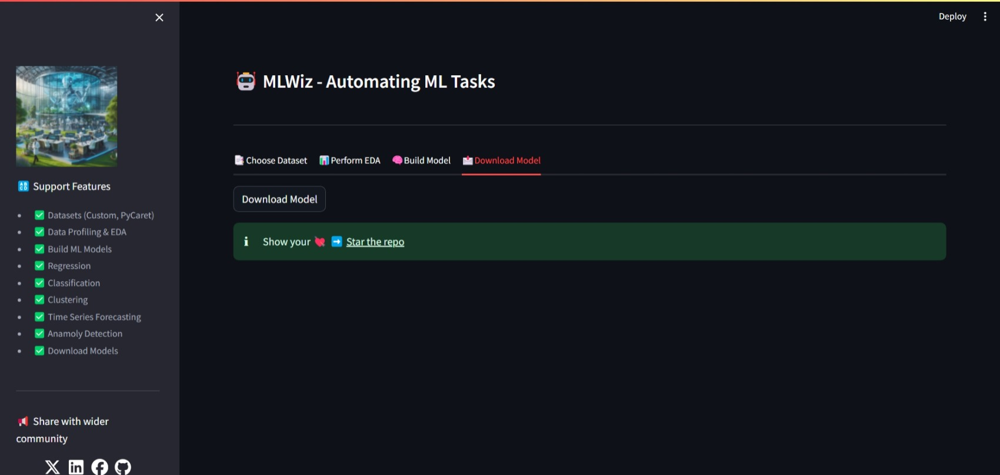
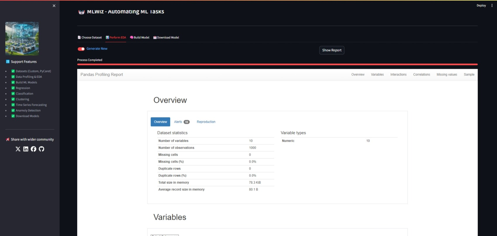

# MLWiz

MLWiz is a user-friendly web application for performing automated machine learning (AutoML) tasks using PyCaret. The app allows you to upload datasets, perform exploratory data analysis (EDA), build various types of machine learning models, and download the trained models. It supports classification, regression, clustering, anomaly detection, and time series forecasting tasks.

## Features

- **Upload Datasets**: Upload your datasets in CSV or XLSX format.

   

- **Load PyCaret Datasets**: Load predefined datasets available through PyCaret.

   

- **Exploratory Data Analysis (EDA)**: Generate comprehensive EDA reports using Sweetviz, Pandas Profiling.

   

    
- **Build Models**: Build machine learning models for classification, regression, clustering, anomaly detection, and time series forecasting.

   

   
   
- **Download Models**: Download the trained models for further use.

## Installation

1. **Clone the repository:**
   ```bash
   git clone https://github.com/bitbotcoder/mlwiz.git
   cd ai-insight-hub

2. **Create and activate a virtual environment (optional but recommended):**
    ```bash
        python -m venv venv
        source venv/bin/activate  # On Windows, use `venv\Scripts\activate`

3. **Install the required dependencies:**
   ```bash
      pip install -r requirements.txt

4. **Running the App**
    To run the Streamlit app, execute the following command in your terminal:
    ```bash
        streamlit run app.py

### Usage 
1. Choose Dataset: Select a dataset source (Upload or PyCaret) and load the dataset.
2. Perform EDA: Navigate to the "Perform EDA" section to generate an EDA report.
3. Build Model: Navigate to the "Build Model" section to configure and train a machine learning model.
4. Download Model: Navigate to the "Download Model" section to download the trained model.

### File Structure
 - `app.py`: The main entry point for the Streamlit app.
 - `ml_pipeline.py`: Contains the functions for data loading, EDA, model building, and model downloading.
 - `requirements.txt`: Lists the Python packages required to run the app.

### Dependencies
 - streamlit
 - pandas
 - sweetviz
 - pycaret

6. Install the dependencies using the command:
   ```bash
     pip install -r requirements.txt

Contributing
Contributions are welcome! Please fork the repository and create a pull request with your changes.

License
This project is licensed under the MIT License. See the LICENSE file for more details.

Acknowledgements
- Streamlit
- PyCaret
- Sweetviz
- Ydata profiling
